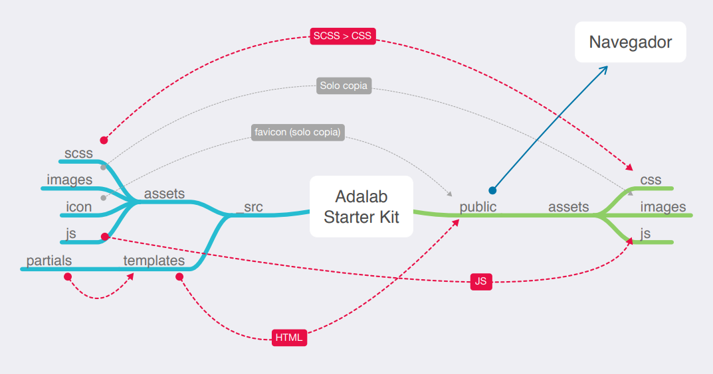

# EVALUACIÓN FINAL/MOD1/MARTA FRAGA

Hey! Este es mi proyecto final para el módulo 1. He utilizado Starter Kit, que está creado en **node y gulp**. ¿Y qué es ese Starter kit? Pues es una **plantilla de proyecto con funcionalidades preinstaladas y preconfiguradas**.

Este Kit incluye un motor de plantillas HTML, el preprocesador SASS y un servidor local y muchas cosas más. El Kit me ha ayudado a trabajar más cómodamente,automatizando tareas.

En mi Kit hay 3 tipos de ficheros y carpetas:

- Los ficheros que están sueltos en la raíz del repositorio, como gulpfile.js, package.json... Son la configuración del proyecto y no los he modificado.
- La carpeta `src/`: son los ficheros de mi página web, como HTML y CSS.
- Las carpetas `public/` y `docs/`, que son generadas automáticamente cuando arrancO el proyecto. El Kit lee los ficheros que hay dentro de `src/`, los procesa y los genera dentro de `public/` y `docs/`.

## Guía de inicio rápido

> **NOTA:** Me he instalado [Node JS](https://nodejs.org/) para trabajar con este Starter Kit:

### Pasos para arrancar el proyecto:

Una vez instaladas las dependencias del Starter Kit que he usado, se arranca el proyecto. **El proyecto lo he arrancado cada vez que me he puesto a programar.** Para ello he utilizado el comando:

```bash
npm start
```

Este comando:

- **Abre una ventana de Chrome y muestra mi página web**, al igual que hace el plugin de VS Code Live Server (Go live).
- También **observa** todos los ficheros que hay dentro de la carpeta `src/`, para que cada vez que modifique un fichero **refresca tu página en Chrome**.
- También **procesa los ficheros** HTML, SASS / CSS y JS y los **genera y guarda en la carpeta `public/`**. Por ejemplo:
  - Convierte los ficheros SASS en CSS.
  - Combina los diferentes ficheros de HTML y los agrupa en uno o varios ficheros HTML.

Después de ejecutar `npm start` he empezado a editar todos los ficheros que están dentro de la carpeta `src/` para programar cómodamente.

## Flujo de archivos con Gulp

Estas tareas de Gulp producen el siguiente flujo de archivos:



## `gulpfile.js` y `config.json`

Nuestro **gulpfile.js** usa el fichero `config.json` de configuración con las rutas de los archivos a generar / observar.

De esta manera separarmos las acciones que están en `gulpfile.js` de la configuración de las acciones que están en `config.json`.

## Estructura de carpetas

Mi estructura de carpetas tiene esta pinta:

```
src
 ├─ api // los ficheros de esta carpeta se copian en public/api/
 |  └─ data.json
 ├─ images
 |  └─ logo.jpg
 ├─ js // los ficheros de esta carpeta se concatenan en el fichero main.js y este se guarda en public/main.js
 |  ├─ main.js
 |  └─ events.js
 ├─ scss
 |  ├─ components
 |  ├─ core
 |  ├─ layout
 |  └─ pages
 └─ html
    └─ partials
```

## Fases y descripción del proyecto

El objetivo de la evaluación final del módulo 1, era desarrollar una página web en diferentes dispositivos, adaptando las mediaqueries a su uso. Así como disponer de unas serie de requisitos técnicos que le dieran propiedad y carácter a la página.

El propósito era que volcáramos todos nuestro conocimientos de estructura en HTML, CSS, SASS, GIT y demás herramientas utilizadas durante el curso.

Inicialmente, como se detalla en la guía superior, utilicé un fichero del kit, el cual adecué en función de mi trabajo.

Trabajé en la carpeta 'src', donde fuí estructurando el HTML, en partials, y maquetando, de la misma manera, en SCSS con los layouts.

Todas mis actualizaciones se reflejan en la carpeta 'public' y 'docs'. En el enlace ami GitHub Pages, se pueden ver los diferentes pasos que seguí.

## Key Topics

He utilizado las siguientes herramientas:

**Command-line basics**
-Navigating the file tree
-Creating, copying, and removing files and directories
**HTML**
-Semantic elements, tags
-Attributes
-Best practices: indentation, file naming conventions and directory structure
**CSS**
-Order of importance
-Class vs. id
-Selectors
-Typography
-Box model
-Positioning and floats
-Color: hexadecimal, rgb and named
-Transitions
-Animations
**Git & Git workflow/Node**
-git clone
-git add
-git commit
-git push
-git pull
-npm run docs
-npm start
**GitHub**
-Create a repository
-Deploy to personal pages

### Proyecto:

El proyecto realizado, su principal uso es de aprendizaje:
-Crear links que deriven a diferentes url, en diferentes pestañas
-Scroll down y scroll up
-Buttons interactivos
-links
-menu
-animaciones
-uso de grid
-uso de flexbox
-variables CSS

### Desafíos:

El mayor desafío fue integrar todos los conocimientos y al estructura general de HTML y CSS, para qye construyeran una página sólida y bien distribuida.

Dentro de dichos desafíos, muchos están superados y asimilados. Pero aún hay otros que quedan por implementar, como son:
-la columna central, cuya consideración hubiera sido mejor tenerla desde el inicio
-uso de ciertas herramientas, como BEM, para facilitar la lectura de código
-uso de mixins y funciones
-mejora de otros aspectos en cuanto a lenguaje HTML y CSS

## Conclusión

Esta evaluación, me ha permitido condensar y ordenar mis conocimientos. Así como reflexionar sobre errores y mejoras.
